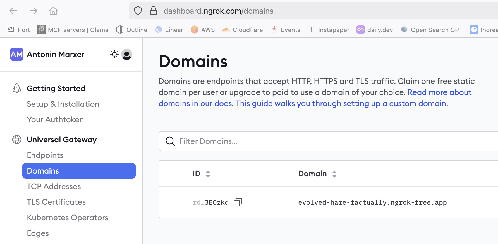
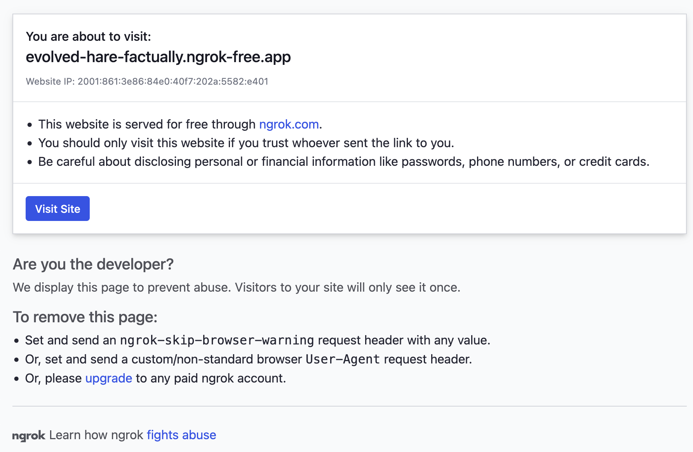

# curxy

#### _cursor_ + _proxy_ + _ngrok_ = **curxy-ngrok**

This is a fork of [curxy](https://github.com/ryoppippi/curxy) that uses Ngrok tunnels instead of cloudflared.

[](https://jsr.io/@ryoppippi/curxy)
[](https://jsr.io/@ryoppippi/curxy)

An proxy worker for using ollama in cursor

## What is this?

This is a proxy worker for using ollama in cursor. It is a simple server that
forwards requests to the ollama server and returns the response.

## Why do you need this?

When we use llm prediction on cusor editor, the editor sends to the data to the
official cursor server, and the server sends the data to the ollama server.
Therefore, even if the endpoint is set to localhost in the cursor editor
configuration, the cursor server cannot send communication to the local server.
So, we need a proxy worker that can forward the data to the ollama server.

## requirements

- deno
- ollama server

## How to use

1. Launch the ollama server

2. Launch curxy

   ```sh
   deno run -A jsr:@ryoppippi/curxy
   ```

   If you want to limit the access to your ollama server, you can set `OPENAI_API_KEY`
   environment variable.

   ```bash
   OPENAI_API_KEY=your_openai_api_key NGROK_AUTHTOKEN=your_ngrok_token NGROK_DOMAIN=your_ngrok_domain deno run -A jsr:@ryoppippi/curxy

   Listening on http://127.0.0.1:62192/
   ◐ Starting ngrok tunnel to http://127.0.0.1:62192
   Server running at: https://your-custom-subdomain.ngrok.io
   ```

   You can get the public URL hosted by ngrok. Optionally, set a custom domain with `NGROK_DOMAIN` env or `--ngrokDomain` CLI arg.

   You can have access to a static subdomain in ngrok by going to _Universal Gateway_ > _Domains_:
   

   A premium account is required, otherwise you'll face this error:
   

3. Enter the URL provided by `curxy` with /v1 appended to it into the "Override
   OpenAl Base URL" section of the cursor editor configuration.


4. Add model names you want to "Model Names" section of the cursor editor
   configuration.


5. (Optional): Additionally, if you want to restrict access to this Proxy Server
   for security reasons, you can set the OPENAI_API_KEY as an environment
   variable, which will enable access restrictions based on the key.

6. **Enjoy!**

Also, you can see help message by `deno run -A jsr:@ryoppippi/curxy --help`

## Related

[Japanese Article](https://zenn.dev/ryoppippi/articles/02c618452a1c9f)

## License

MIT
